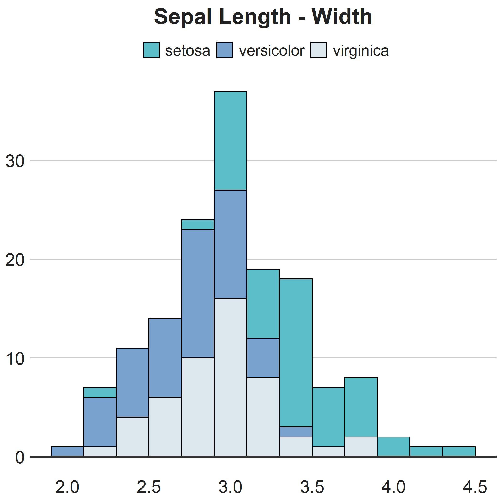

<!-- README.md is generated from README.Rmd. Please edit that file -->

```{r, include = FALSE}
knitr::opts_chunk$set(
  collapse = TRUE,
  comment = "#>",
  fig.path = "man/figures/",
  out.width = "100%"
)
```

# ntnupal

<!-- badges: start -->
<!-- badges: end -->

ntnupal provides two things:
1. A consistent NTNU theme to ggplots
2. A colour scheme based on the official colours of NTNU


## Installation

You can install the development version from [GitHub](https://github.com/) with:

``` r
# install.packages("devtools")
devtools::install_github("henrikkarlstrom/ntnupal")
```
## Example

Simply add `theme_ntnu()` and `scale_fill_ntnu()` or `scale_color_ntnu()` at the end of your plot:

```{r example, eval = FALSE}
library(ntnupal)
library(ggplot2)

ggplot(
  data = iris, 
  aes(x = Sepal.Width)
  ) + 
  geom_histogram(
    aes(fill = Species), 
    binwidth = 0.2, 
    color = "black") + 
  geom_hline(
    yintercept = 0, 
    size = 1, 
    color = "#333333") + 
  theme_ntnu() + 
  labs(
    title = "Distribution of sepal widths by species") + 
  scale_fill_ntnu("cool")

```

